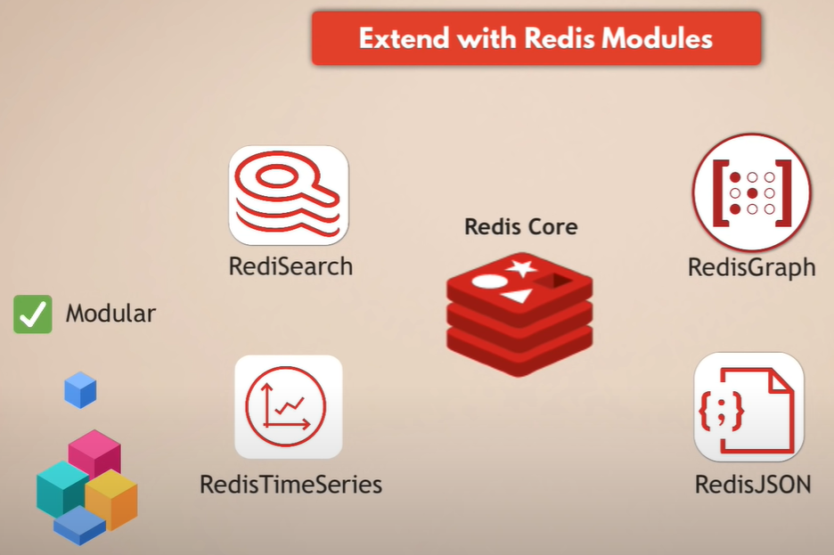
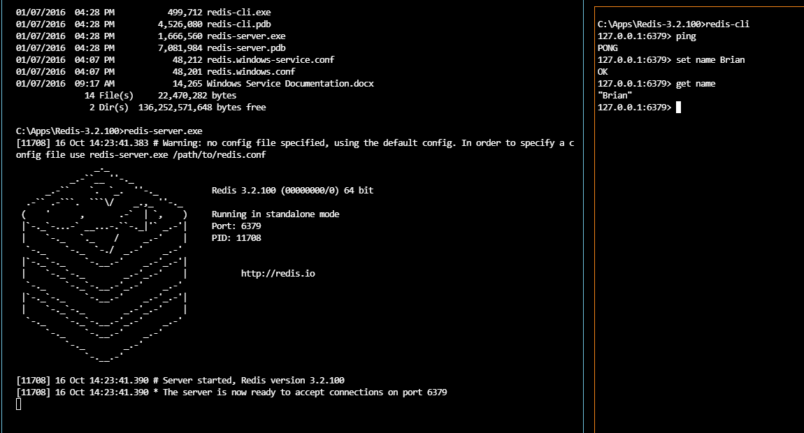
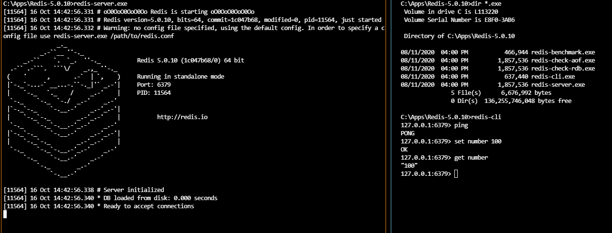
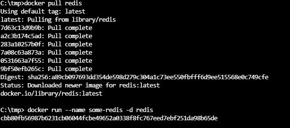

# Install Redis on Windows 10

## Set up

```
https://github.com/microsoftarchive/redis/releases
3.2.100
Redis-x64-3.2.100.zip
cd C:\Apps\Redis-3.2.100
redis-server.exe
redis-cli.exe
Port: 6379
```

```
https://github.com/tporadowski/redis/releases
5.0.10
Redis-x64-5.0.10
cd C:\Apps\Redis-5.0.10
redis-server.exe
redis-cli.exe
Port: 6379
```

```
docker pull redis
```

## Redis commands

```dos
set <name> <value>
get <name>
del <name>
exists <name>
keys *
flushall
ttl <name>
expire <name> 10
setex <name> 10 <value>
lpush <array> <value1>
lrange <array> 0 -1
lpush <array> <value2>
rpush <array> <value3>
lpop <array>
rpop <array>
sadd <set> <value1>
sadd <set> <value2>
smembers <set>
srem <array> <value1>
hset <hash> <name1> <value1>
hget <hash> <name1>
hset <hash> <name2> <value2>
hgetall <hash>
hdel <hash> <name2>
hdelall <hash>
hexists <hash> <name3>
clear
```

## Extend with Redis modules



- Redis Core
- RedisSearch
- RedisGraph
- RedisTimeSeries
- RedisJSON
- Modular

## Knowledge Points

```
Redis
TLS
Hash vs Set
```

## Screenshot






