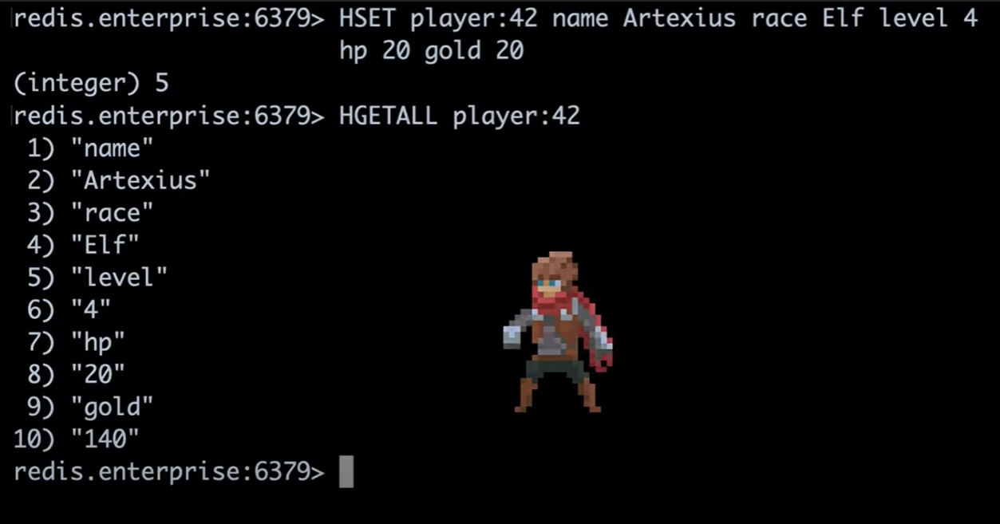
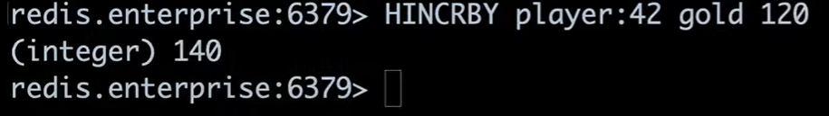
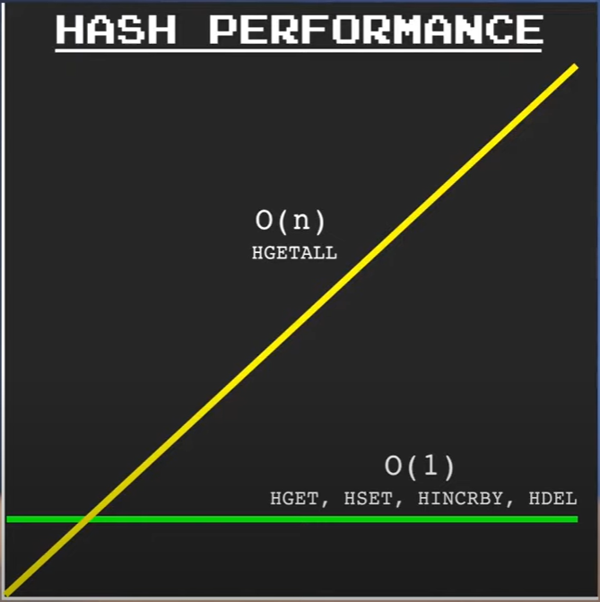
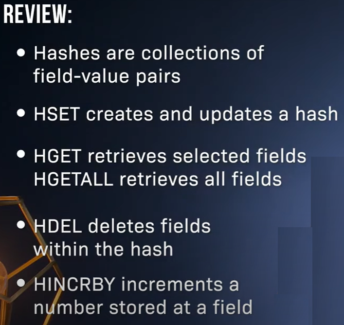
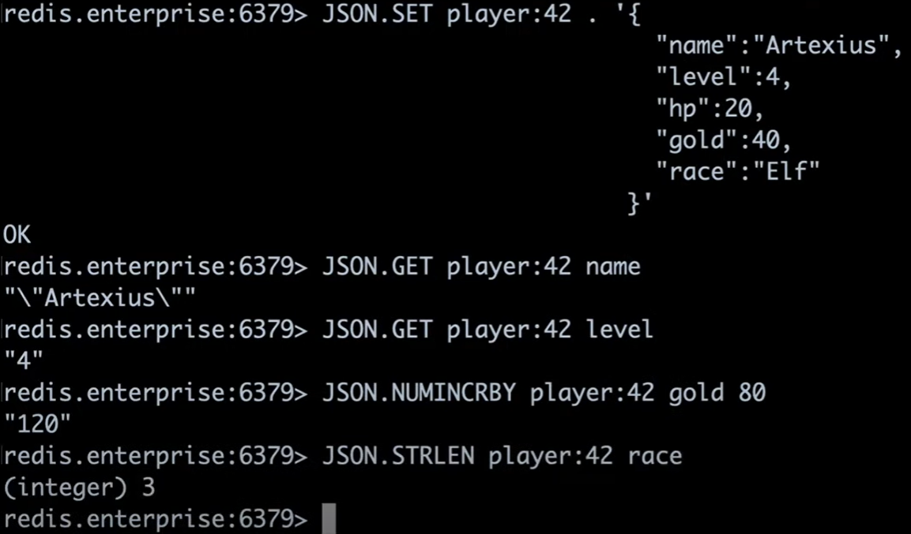
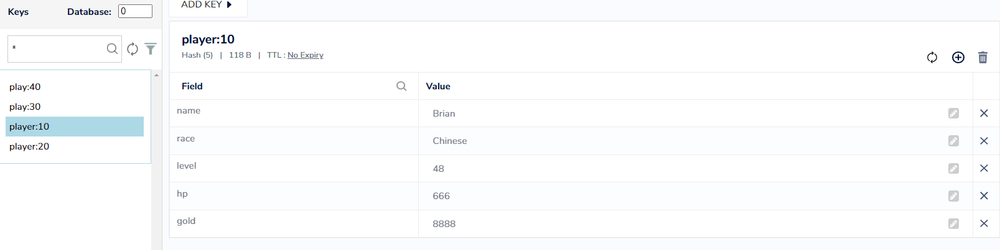

# MyRedis

My Redis

## Redis Hash

HSET

HGETALL




HGET


HINCRBY









HMSET vs HSET

```dos
HMSET player:10 name Brian race Chinese level 48 hp 666 gold 8888
HSET player:20 name Effie race Chinese level 10 hp 99 gold 777
HSET play:30 name Emily
HMSET play:40 name Jessie
```

```dos
127.0.0.1:6379> HMSET player:10 name Brian race Chinese level 48 hp 666 gold 8888
OK
127.0.0.1:6379> HSET player:20 name Effie race Chinese level 10 hp 99 gold 777
(integer) 5
127.0.0.1:6379> HSET play:30 name Emily
(integer) 1
127.0.0.1:6379> HMSET play:40 name Jessie
OK
```


