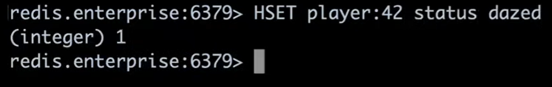
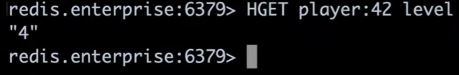

# MyRedis

My Redis

## Redis Hash

HSET

HGETALL




HGET



HINCRBY


HMSET vs HSET

```dos
HMSET player:10 name Brian race Chinese level 48 hp 666 gold 8888
HSET player:20 name Effie race Chinese level 10 hp 99 gold 777
HSET play:30 name Emily
HMSET play:40 name Jessie
```

```dos
127.0.0.1:6379> HMSET player:10 name Brian race Chinese level 48 hp 666 gold 8888
OK
127.0.0.1:6379> HSET player:20 name Effie race Chinese level 10 hp 99 gold 777
(integer) 5
127.0.0.1:6379> HSET play:30 name Emily
(integer) 1
127.0.0.1:6379> HMSET play:40 name Jessie
OK
```


## Redis Hash NodeJS code example


```dos
Example Node.js Code:
---------------------
redisClient.hmset('Animal', {'Dog' : 'wuff wuff'}, (err, reply) => {
      if(err) {
        console.error(err);
      } else {
        console.log(reply);
      }
    });
Example Redis Commands:
----------------------
127.0.0.1:6379> hmset Animal Dog "wuff wuff"

127.0.0.1:6379> keys *
1) "Animal"

127.0.0.1:6379> hgetall Animal
1) "Dog"
2) "wuff wuff"
```

```dos
Example Node.js Code:
---------------------
redisClient.hgetall(category, (err, object) => {
      if(err) {
        console.error(err);
      } else {
        console.log(object);
      }
    });
```

```dos
127.0.0.1:6379> hmget Animal Dog
1) "wuff wuff"
Example Node.js Code:
---------------------
redisClient.hmget(category, speciesName, (err, object) => {
      if(err) {
        console.error(err);
      } else {
        console.log(object);
      }
    });
```

## Redis LUA script

Note, the Lua indexed tables start with index 1, not 0.

```dos
127.0.0.1:6379> keys Ucar*
(empty list or set)

127.0.0.1:6379> keys UCAR*
1) "UCAR_TV_LSM_102"
2) "UCARModelToTagGroup:TV_LSM_102"

127.0.0.1:6379> hgetall UCARModelToTagGroup:TV_LSM_102
1) "customerSegmentModelType"
2) "segment"
3) "tagGroup"
4) "UCAR_TV_LSM_102"

127.0.0.1:6379> smembers UCAR_TV_LSM_102
1) "UCAR_TV_LSM_102_Bronze"
2) "UCAR_TV_LSM_102_Silver"
3) "UCAR_TV_LSM_102_Gold"
```

==>

```dos
127.0.0.1:6379> eval "return redis.call('smembers', KEYS[1])" 1 "UCAR_TV_LSM_102"
1) "UCAR_TV_LSM_102_Bronze"
2) "UCAR_TV_LSM_102_Silver"
3) "UCAR_TV_LSM_102_Gold"

127.0.0.1:6379> eval "return redis.call('hgetall', KEYS[1])" 1 "UCARModelToTagGroup:TV_LSM_102"
1) "customerSegmentModelType"
2) "segment"
3) "tagGroup"
4) "UCAR_TV_LSM_102"
```


```dos
eval "for _,m in ipairs(redis.call('keys','UCARModelToTagGroup:*')) do redis.call('hgetall',m) end" 0
```
