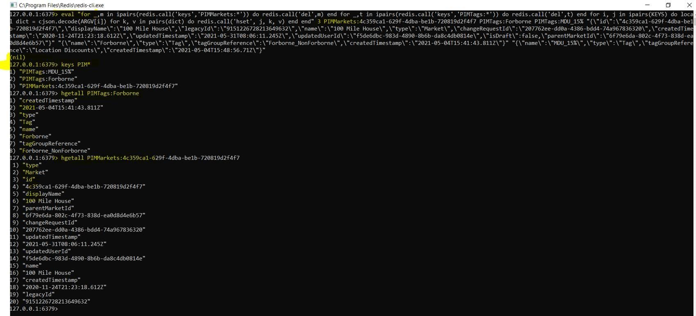
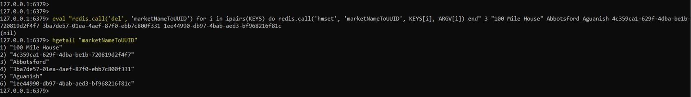

# Redis Cli Script

## Bulk delete script!

### Check cache keys

```dos
127.0.0.1:6379> keys UCAR*
1) "UCARModelToTagGroup:TV_LSM_104"
2) "UCARModelToTagGroup:TV_LSM_102"
3) "UCARModelToTagGroup:TV_LSM_103"
127.0.0.1:6379> hgetall "UCARModelToTagGroup:TV_LSM_102"
1) "customerSegmentModelType"
2) "segment"
3) "tagGroup"
4) "[UCAR]_[TV_LSM_102]_[Some Display Name 1]"
127.0.0.1:6379> hgetall "UCARModelToTagGroup:TV_LSM_103"
1) "customerSegmentModelType"
2) "score"
3) "tagGroup"
4) "[UCAR]_[TV_LSM_103]_[Some Display Name 2]"
127.0.0.1:6379> hgetall "UCARModelToTagGroup:TV_LSM_104"
1) "customerSegmentModelType"
2) "percentile"
3) "tagGroup"
4) "[UCAR]_[TV_LSM_104]_[Some Display Name 3]"
```

```dos
127.0.0.1:6379> keys ?UCAR*
1) "[UCAR]_[TV_LSM_104]_[Some Display Name 3]"
2) "[UCAR]_[TV_LSM_103]_[Some Display Name 2]"
3) "[UCAR]_[TV_LSM_102]_[Some Display Name 1]"
127.0.0.1:6379> smembers "[UCAR]_[TV_LSM_102]_[Some Display Name 1]"
1) "[UCAR]_[TV_LSM_102]_[Gold]"
2) "[UCAR]_[TV_LSM_102]_[Bronze]"
3) "[UCAR]_[TV_LSM_102]_[Silver]"
127.0.0.1:6379> smembers "[UCAR]_[TV_LSM_103]_[Some Display Name 2]"
1) "[UCAR]_[TV_LSM_103]_[0-10]"
2) "[UCAR]_[TV_LSM_103]_[10-50]"
3) "[UCAR]_[TV_LSM_103]_[50-100]"
127.0.0.1:6379> smembers "[UCAR]_[TV_LSM_104]_[Some Display Name 3]"
1) "[UCAR]_[TV_LSM_104]_[0-3]"
2) "[UCAR]_[TV_LSM_104]_[70]"
3) "[UCAR]_[TV_LSM_104]_[3-88]"
```

### Bulk delete cache keys in Redis CLI

```dos
127.0.0.1:6379> eval "for _,m in ipairs(redis.call('keys','UCARModelToTagGroup*')) do redis.call('del',m) end" 0
(nil)
127.0.0.1:6379> eval "for _,m in ipairs(redis.call('keys','?UCAR*')) do redis.call('del',m) end" 0
(nil)
```

The following 2 don't work!

`eval "for _,m in ipairs(redis.call('keys','[UCAR*')) do redis.call('del',m) end" 0`

`eval "for _,m in ipairs(redis.call('keys','\[UCAR*')) do redis.call('del',m) end" 0`

## Some Redis client script examples.

### Redis script for delete location mapping cache:

Command:

```dos
eval "for _,m in ipairs(redis.call('keys','locationToTagMapping:*')) do redis.call('del',m) end" 0
```

### Deletes old tags and market entities, then insert new markets and tags

Ccurrent script is cut to 3 entities update instead of 700 entities. It inserts 2 Tags and one Market entity.

Command template:

```dos
eval <script> <amount of entities> <list of markets keys separated by spaces> <list of tags keys separated by spaces > <list of market sting-serialized JSON values in double quotes, separated by space> <list of market sting-serialized JSON values in double quotes, separated by space>
```

Command:

```dos
eval "for _,m in ipairs(redis.call('keys','PIMMarkets:*')) do redis.call('del',m) end for _,t in ipairs(redis.call('keys','PIMTags:*')) do redis.call('del',t) end for i, j in ipairs(KEYS) do local dict = cjson.decode(ARGV[i]) for k, v in pairs(dict) do redis.call('hset', j, k, v) end end" 3 PIMMarkets:4c359ca1-629f-4dba-be1b-720819d2f4f7 PIMTags:Forborne PIMTags:MDU_15% "{\"id\":\"4c359ca1-629f-4dba-be1b-720819d2f4f7\",\"displayName\":\"100 Mile House\",\"legacyId\":\"9151226728213649632\",\"name\":\"100 Mile House\",\"type\":\"Market\",\"changeRequestId\":\"207762ee-dd0a-4386-bdd4-74a967836320\",\"createdTimestamp\":\"2020-11-24T21:23:18.612Z\",\"updatedTimestamp\":\"2021-05-31T08:06:11.245Z\",\"updatedUserId\":\"f5de6dbc-983d-4890-8b6b-da8c4db0814e\",\"isDraft\":false,\"parentMarketId\":\"6f79e6da-802c-4f73-838d-ea0d8d4e6b57\"}" "{\"name\":\"Forborne\",\"type\":\"Tag\",\"tagGroupReference\":\"Forborne_NonForborne\",\"createdTimestamp\":\"2021-05-04T15:41:43.811Z\"}" "{\"name\":\"MDU_15%\",\"type\":\"Tag\",\"tagGroupReference\":\"Location Discounts\",\"createdTimestamp\":\"2021-05-04T15:48:56.71Z\"}"
```

Verify:

```dos
keys PIM*
hgetall PIMTags:Forborne
```

Screenshot:



### Delete old marketNameToUUID mapping then rebuild it

Current script is cut to 3 entities instead of 661 entites.

Command template:

```dos
eval <script> <amount of entities> <list of markets names> <list of market uuid-values>
```

Command:

```dos
eval "redis.call('del', 'marketNameToUUID') for i in ipairs(KEYS) do redis.call('hmset', 'marketNameToUUID', KEYS[i], ARGV[i]) end" 3 "100 Mile House" Abbotsford Aguanish 4c359ca1-629f-4dba-be1b-720819d2f4f7 3ba7de57-01ea-4aef-87f0-ebb7c800f331 1ee44990-db97-4bab-aed3-bf968216f81c
```

Verify:

```dos
hgetall "marketNameToUUID"
```

Screenshot:


