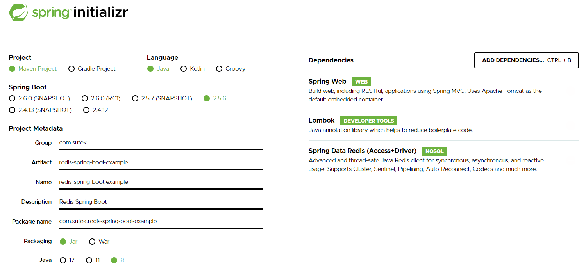

# Redis Spring Boot

## Set up

```
https://github.com/tporadowski/redis/releases
5.0.10
Redis-x64-5.0.10
cd C:\Apps\Redis-5.0.10
redis-server.exe
redis-cli.exe
Port: 6379
```

```
<dependency>
    <groupId>redis.clients</groupId>
    <artifactId>jedis</artifactId>
    <version>3.7.0</version>
</dependency>
```

```
RedisTemplate<String, Object> template = new RedisTemplate<>();
template.setConnectionFactory(connectionFactory());
template.setKeySerializer(new StringRedisSerializer());
template.setHashKeySerializer(new StringRedisSerializer());
template.setHashKeySerializer(new JdkSerializationRedisSerializer());
template.setValueSerializer(new JdkSerializationRedisSerializer());
template.setEnableTransactionSupport(true);
template.afterPropertiesSet();
```

## Knowledge Points

```
Spring Data Redis (SDR)
jedis
```

## Screenshot



